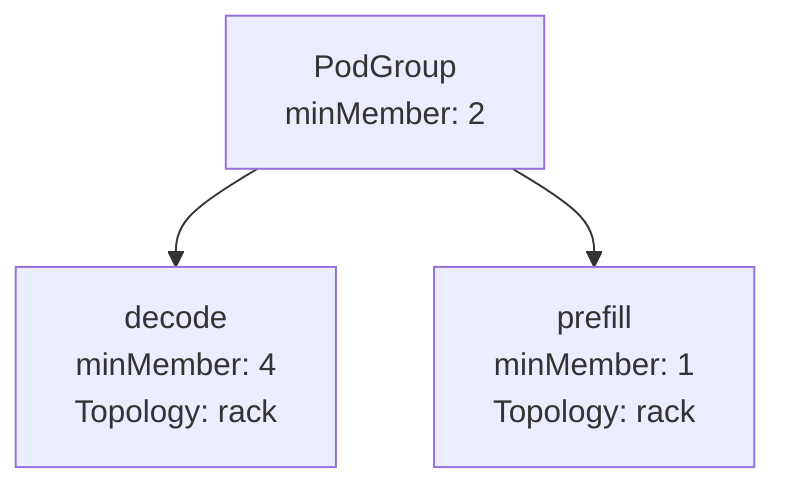
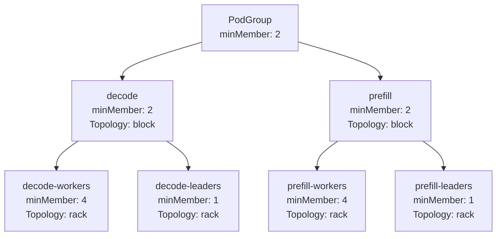
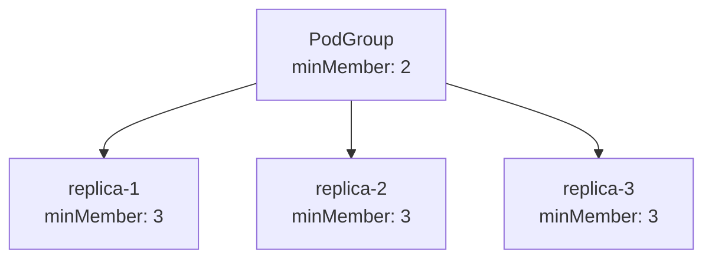
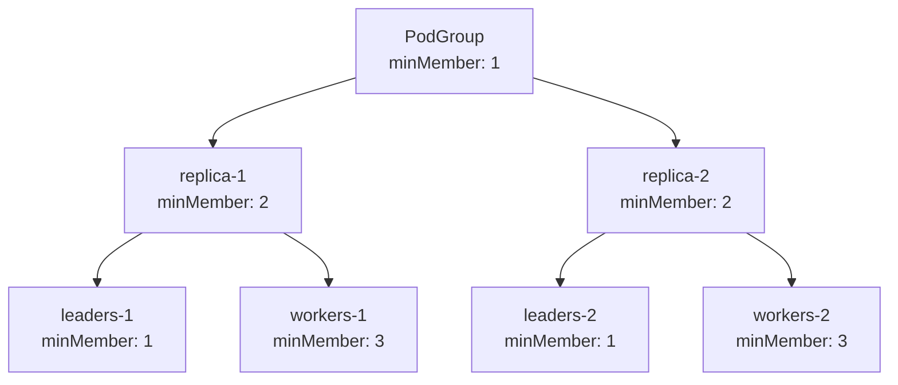

# Hierarchical PodGroup structure

## Overview
This document outlines an enhancement to the PodGroup architecture by introducing SubGroups within a PodGroup, enabling fine-grained control over gang scheduling and topology-aware placement for subsets of pods within a workload. While the PodGroup continues to enforce gang scheduling for the workload as a whole, this extension allows workloads to specify minMember and topology constraints on individual SubGroups, providing greater resolution over how smaller groups of pods are placed and scheduled. For example, a SubGroup can specify that only a subset of its pods must be scheduled together (minMember) and define specific network topology constraints aligned with that subset’s requirements. This design preserves atomic workload scheduling semantics while enabling advanced, granular placement policies that align closely with topology-aware scheduling strategies.

## Motivation
Modern inference workloads consist of components with varying network sensitivity and resource requirements, necessitating the ability to express fine-grained scheduling and placement preferences within the context of gang-scheduled workloads. Uniform constraints at the PodGroup level may impose overly restrictive placement requirements, failing to capture the nuanced needs of distinct workload components. By introducing SubGroups within a PodGroup, workloads can specify per-SubGroup minMember requirements and topology constraints while maintaining overall gang scheduling semantics. This enables advanced placement strategies, improves scheduling flexibility and efficiency, and ensures differentiated placement and subgroup-level gang constraints can be expressed without compromising the workload’s atomic scheduling guarantees.

## Goals
- Enable fine-grained scheduling specification: Allow PodGroups to define how smaller SubGroups of pods should be scheduled, specifying minMember and topology constraints per SubGroup.
- Preserve atomicity while enabling flexibility: Maintain gang scheduling semantics at the workload level while enabling per-SubGroup constraints for granular control over subsets of pods.
- Support advanced topology-aware placement: Allow SubGroups within a PodGroup to define specific topology constraints for precise placement within the cluster.
- Enhance workload-aligned resource utilization: Improve cluster utilization by supporting differentiated placement strategies without imposing overly restrictive uniform constraints.
- Maintain backward compatibility: Ensure existing workloads using PodGroups without SubGroups continue to function without modification.

## Non-Goals
- Partial Workload Execution: This design does not support executing subsets of pods independently before the PodGroup’s gang scheduling conditions are met.
- Topology Discovery and Optimization: The design does not include enhancements for topology discovery or automated topology optimization.
- Changes to Pod-Level Scheduling: This enhancement does not alter pod-level scheduling mechanisms beyond the SubGroup minMember and topology constraints applied within the PodGroup context.

## User Stories

### User Story 1: Fine-Grained Gang Scheduling
I want to specify a PodGroup requiring 10 pods to be scheduled atomically, while defining that the decode-workers SubGroup requires at least 4 pods to be scheduled as a gang, enabling better resource alignment for my workload’s architecture.

### User Story 2: SubGroup-Specific Topology Constraints
I want one SubGroup to be placed within the same rack for low latency, while allowing another SubGroup pods to be placed flexibly across the cluster, aligning network-sensitive components with workload requirements.

### User Story 3: Multi-SubGroup Workload with Co-Located Leaders and Workers
I want to define decode-leaders, decode-workers, prefill-leaders, and prefill-workers SubGroups where leaders and workers are co-located within each group, but prefill and decode groups may be scheduled in different locations to optimize resource placement.

### User Story 4: Minimum Replica Threshold for Multi-Replica Workloads
I want to define a PodGroup with multiple replicas of the same workload and require that a minimum number of replicas are gang scheduled before the workload starts. Beyond this threshold, the scheduler should opportunistically schedule additional replicas as resources become available.

### User Story 5: Auto-Scaling SubGroup Sets with Gang Scheduling
I want to define specific sets of SubGroups that can auto-scale, so that when scaling occurs, new replicas of the SubGroups within those sets are created. I want each replica to be scheduled as a gang, but only a minimum of one replica is required to start running, ensuring elasticity while preserving gang semantics.

### User Story 6: Backward Compatibility
I want my existing PodGroups without SubGroups to continue working without modification, ensuring a seamless migration path for advanced scheduling capabilities.

## Design Proposal
This proposal extends the PodGroup CRD and scheduling flow to introduce SubGroups within a PodGroup, enabling workloads to define fine-grained gang scheduling (minMember) and topology constraints for subsets of pods while preserving gang scheduling semantics at the workload level.

## Key Concepts
- PodGroup represents a workload scheduled atomically using gang scheduling. 
  - The PodGroup is divided into distinct SubGroups, enabling structured subdivision of the workload while preserving atomic scheduling boundaries. 
  - Scheduling Semantics:
    - The PodGroup is scheduled atomically (gang scheduling) to guarantee coordinated workload orchestration and execution consistency.
    - SubGroups enable fine-grained placement and policy specification while maintaining atomicity; partial execution of the workload is not permitted.
- SubGroup is a logical subset within a PodGroup, enabling scoped placement and scheduling requirements:
  - name: Unique identifier within the parent PodGroup.  
    minMember: Specifies the minimum number of entities required within the SubGroup to satisfy scheduling constraints. These entities may be pods or child SubGroups.
  - parent: the name of the parent SubGroup.
  - Pods are assigned to SubGroups with `kai.scheduler/subgroup-name` label, where the value is the name of the respective SubGroup. Pods are assigned to leaf SubGroups only.
- TopologyConstraints – Provides hierarchical placement control across three levels:
  - A global constraint applied to all pods in the PodGroup when no more specific constraint is defined. 
  - Specific constraints applied to explicitly named SubGroups for targeted placement control. 
  - Shared constraints applied to sets of SubGroups collectively, enabling coordinated placement policies across related SubGroups.

## API Changes
To support SubGroups within a PodGroup, the PodGroupSpec API is extended as follows:
```go
// PodGroupSpec defines the desired state of a PodGroup, representing a workload to be scheduled as a gang.
type PodGroupSpec struct {
    // MinMember defines the minimal number of members to run the PodGroup;
    // if there are not enough resources to start all required members, the scheduler will not start anyone.
    MinMember int32 `json:"minMember,omitempty"`
    
    // Queue defines the queue to allocate resource for PodGroup; if queue does not exist,
    // the PodGroup will not be scheduled.
    Queue string `json:"queue,omitempty"`
    
    // If specified, indicates the PodGroup's priority. "system-node-critical" and
    // "system-cluster-critical" are two special keywords which indicate the
    // highest priorities with the former being the highest priority. Any other
    // name must be defined by creating a PriorityClass object with that name.
    // If not specified, the PodGroup priority will be default or zero if there is no
    // default.
    // +optional
    PriorityClassName string `json:"priorityClassName,omitempty"`
    
    // Should add "Unschedulable" event to the pods or not.
    MarkUnschedulable *bool `json:"markUnschedulable,omitempty"`
    
    // The number of scheduling cycles to try before marking the pod group as UnschedulableOnNodePool. Currently only supporting -1 and 1
    SchedulingBackoff *int32 `json:"schedulingBackoff,omitempty"`
    
    // TopologyConstraints define the topology constraints for this PodGroup
    TopologyConstraints TopologyConstraints `json:"topologyConstraints,omitempty"`
    
    // SubGroups defines finer-grained subsets of pods within the PodGroup with individual scheduling constraints
    SubGroups []SubGroup `json:"subGroups,omitempty"`
}
  
type SubGroup struct {
    // Name uniquely identifies the SubGroup within the parent PodGroup. 
    Name string `json:"name"`

    // Parent is an optional attribute that specifies the name of the parent SubGroup 
    Parent string `json:"parent"`
    
    // MinMember defines the minimal number of members to run this SubGroup;
    // if there are not enough resources to start all required members, the scheduler will not start anyone.
    MinMember int32 `json:"minMember,omitempty"`
}

// TopologyConstraints defines topology constraints at group, subgroup, and subgroup-set levels.
type TopologyConstraints struct {
    // Global applies the constraint to all pods in the PodGroup if no more specific subgroup constraint applies.
    Global *TopologyConstraint `json:"global,omitempty"`
    
    // SubGroups defines topology constraints for specific named subgroups.
    // The key is the subgroup name, and the constraint applies to all pods in that subgroup.
    SubGroups map[string]TopologyConstraint `json:"subGroups,omitempty"`
    
    // SubGroupSets allows defining constraints that apply to multiple subgroups collectively.
    // Each entry specifies a set of subgroup names to which the constraint will be applied.
    // Useful for scenarios where several subgroups need to share the same topology policy.
    SubGroupSets []SubGroupSetTopologyConstraint `json:"subGroupSets,omitempty"`
}

// SubGroupSetTopologyConstraint defines a topology constraint for a set of subgroup names.
type SubGroupSetTopologyConstraint struct {
    // SubGroups is the list of subgroup names that this constraint applies to collectively.
    SubGroups []string `json:"subGroups"`
    
    // Constraint defines the topology constraint to apply to the listed subgroups.
    Constraint TopologyConstraint `json:"constraint"`
}

type TopologyConstraint struct {
    // PreferredTopologyLevel defines the preferred level in the topology hierarchy
    // that this constraint applies to (e.g., "rack", "zone", "datacenter").
    // Jobs will be scheduled to maintain locality at this level when possible.
    PreferredTopologyLevel string `json:"preferredTopologyLevel,omitempty"`
    
    // RequiredTopologyLevel defines the maximal level in the topology hierarchy
    // that all pods must be scheduled within.
    // If set, all pods of the job must be scheduled within a single domain at this level.
    RequiredTopologyLevel string `json:"requiredTopologyLevel,omitempty"`
    
    // Topology specifies the name of the topology CRD that defines the
    // physical layout to use for this constraint. This allows for supporting
    // multiple different topology configurations in the same cluster.
    Topology string `json:"topology,omitempty"`
}
```

### Validation
The following validations will be enforced via a Validating Webhook:
- Unique SubGroup name validation - ensure that all SubGroups within a PodGroup have unique names, preventing conflicts and enabling reliable hierarchical processing during scheduling.
- Validate that, if SubGroups are defined, the PodGroup’s global minMember is not larger than the number of SubGroups to ensure scheduling consistency.
- SubGroup membership validation - the Validating Webhook can enforce that each pod associated with the workload is assigned to exactly one SubGroup and each SubGroup is part in a single SubGroupSet, ensuring clear, non-overlapping SubGroup membership across all pods within the PodGroup.

## Examples

### Example 1: PodGroup with Two SubGroups
This example demonstrates a PodGroup with two SubGroups, each defining distinct minMember requirements and enforcing rack-level topology constraints to ensure efficient, localized scheduling.

```yaml
spec:
  minMember: 2 # (decode) + (prefill), ensuring the gang scheduling invariant
  subGroups:
  - name: decode
    minMember: 4

  - name: prefill
    minMember: 1
      
  topologyConstraints:
    subGroups:
      decode:
        requiredTopologyLevel: rack
      prefill:
        requiredTopologyLevel: rack
```

### Example 2: Multi-SubGroup Leaders and Workers
This example illustrates a hierarchical PodGroup structure with multiple SubGroups representing leaders and workers, applying both rack-level and block-level topology constraints to achieve co-located placement within each logical group while allowing separation between groups.

```yaml
spec:
  minMember: 2  # To ensure gang scheduling, both decode and prefill SubGroups need to be scheduled 
  subGroups:
    - name: decode
      minMember: 2

    - name: decode-workers
      parent: decode
      minMember: 4

    - name: decode-leaders
      parent: decode
      minMember: 1

      
    - name: prefill
      minMember: 2

    - name: prefill-workers
      parent: prefill
      minMember: 4

    - name: prefill-leaders
      parent: prefill
      minMember: 1

  topologyConstraints:
    subGroups:
      decode-workers:
        requiredTopologyLevel: rack
      decode-leaders:
        requiredTopologyLevel: rack
      prefill-workers:
        requiredTopologyLevel: rack
      prefill-leaders:
        requiredTopologyLevel: rack

    subGroupSets:
      - subGroups:
          - decode-workers
          - decode-leaders
        constraint:
          requiredTopologyLevel: block
      - subGroups:
          - prefill-workers
          - prefill-leaders
        constraint:
          requiredTopologyLevel: block
```

### Example 3: PodGroup with Minimum Replica Threshold
This example demonstrates a PodGroup representing multiple replicas of the same workload. The minMember field specifies that a minimum number of replicas must be scheduled before the workload can start. Additional replicas can be scheduled opportunistically once resources become available.

```yaml
spec:
  minMember: 2 # Minimum number of replicas required to satisfy gang scheduling constraints
  subGroups:
    - name: replica-1
      minMember: 3
    
    - name: replica-2
      minMember: 3
    
    - name: replica-3
      minMember: 3
```

### Example 4: Auto-Scaling of SubGroup Set
This example demonstrates a workload that contains two child SubGroups (leaders and workers). The entire workload can auto-scale, meaning new replicas of leaders and workers are created together. Each such replica must be scheduled as a gang, but only a minimum of one such replica is required for the workload to start.

```yaml
spec:
  minMember: 1 # One replica required to satisfy scheduling constraints
  subGroups:
    - name: replica-1
      minMember: 2

    - name: leaders-1
      parent: replica-1
      minMember: 1

    - name: workers-1
      parent: replica-1
      minMember: 3

    
    - name: replica-2
      minMember: 2

    - name: leaders-2
      parent: replica-2
      minMember: 1

    - name: workers-2
      parent: replica-2
      minMember: 3
```

## Development
To ensure a controlled and backward-compatible rollout of PodGroup SubGroups with fine-grained scheduling, the following phased development plan is proposed:

### Phase 1: API Definition and Validation
- Extend the PodGroup [CRD](https://github.com/NVIDIA/KAI-Scheduler/blob/main/pkg/apis/scheduling/v2alpha2/podgroup_types.go) to support SubGroups with name and minMember.
- (Optional) Implement optional validation to ensure:
    - Unique SubGroup names within a PodGroup.
    - minMember consistency with global level.
    - Every SubGroup belongs to a single SubGroupSets in topology constraints.
- Guarantee backward compatibility with existing PodGroups that do not define SubGroups.

### Phase 2: Grove Plugin Integration
Update the PodGrouper Grove plugin to:
- Parse Grove CRDs defining hierarchical PodClique structures.
- Construct matching PodGroup CRDs with SubGroups, mapping PodCliques to SubGroups and topology constraints.

### Phase 3: Scheduler Algorithm Adjustments
- Extend the scheduler to support multi-level PodGroup scheduling:
    - Enforce constraints hierarchically, validating higher-level PodGroup constraints before evaluating subordinate SubGroup constraints.
    - Proceed hierarchically, ensuring constraints are met before advancing to deeper levels.
- Preserve gang scheduling semantics at the PodGroup level while enabling fine-grained SubGroup placement.
