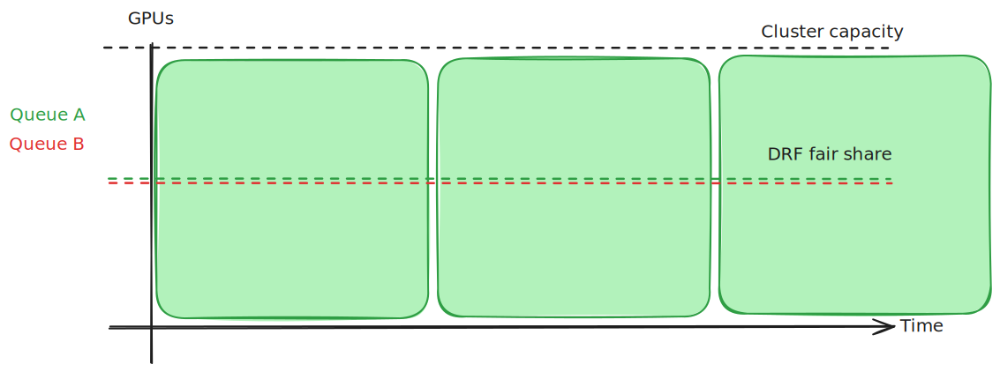
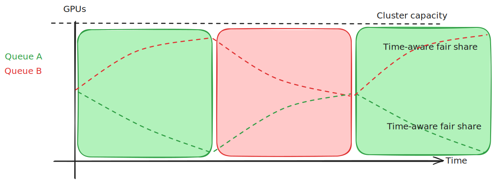

# Time Aware Fairness
<!-- toc -->
- [Summary](#summary)
- [Motivation](#motivation)
  - [Goals](#goals)
  - [Non-Goals](#non-goals)
- [Proposal](#proposal)
  - [Interaction with existing guarantees](#interaction-with-existing-guarantees)
  - [User Stories](#user-stories)
    - [Story 1](#story-1-proportional-time-sharing-of-resources)
    - [Story 2](#story-2-burst-access-to-resources)
    - [Story 3](#story-3-time-aware-fairness-with-guaranteed-resources)
    - [Story 4](#story-4-no-over-usage-open-for-debate)
    - [Story 5](#story-5-resource-hour-budget)
  - [Notes/Constraints/Caveats](#notesconstraintscaveats)
    - [Data storage constraints](#data-storage-constraints)
    - [Intuitive understanding of fairness over time](#intuitive-understanding-of-fairness-over-time)
  - [Risks and Mitigations](#risks-and-mitigations)
- [Design Details](#design-details)
  - [Explanation of the formula](#explanation-of-the-formula)
  - [Cluster-capacity normalized usage](#cluster-capacity-normalized-usage)
  - [Penalizing queues with historical usage](#penalizing-queues-with-historical-usage)
<!-- /toc -->

## Summary

This document aims to describe how the scheduler can make use of historical resource usage by queues and users in order to achieve fairness of resource allocation over time. The mechanism of storing and serving the necessary data is out of scope for this document and will be described in a separate design doc.  
The scheduler will consider past resource allocations when dividing over-quota resources to queues in the DRF algorithm: queues that have used more resource-hours should be penalized compared to queues that have not used resources recently. This will effect the over-quota resource division only, meaning that deserved quota and queue priority will take precedence.  
This will be an opt-in feature: if the admin does not configure time-aware-fairness, the scheduler will behave exactly the same as before.

## Motivation

Time-aware fairness is a desirable behavior for many use cases, as evident by the popularity of HPC systems like slurm, and by the demand for slurm-like schedulers in k8s. Implementing time-aware fairness in KAI will offer users a k8s native scheduler that can offer deserved quotas, for inference and interactive use cases, alongside an HPC-like experience for batch job queueing. See the [user stories](#user-stories) section below for detailed use cases.

### Goals

* Allow fair time-sharing of resources: prioritize queues that have not accessed resources recently over queues that did. Other than deserved quotas, resources should be fairly allocated over time: queues with identical weights and requests will receive similar allocation of resource-hours over a long enough period of time.
* Allow burst access to resources: allow queues in busy clusters to access more resources than their weight for short periods of time.
* Fallback to current behavior: if over-time feature is not configured, the scheduler will behave exactly like today, with classic DRF determining fair share.
* Don't break current guarantees of deserved resources and over-quota priority. 

### Non-Goals
* Guarantee feature parity with any existing HPC system
* In-depth design of the accounting service: this will be addressed in a separate document

## Proposal

Track usage data of resources by queues over time, with a configurable decay formula and reset period. Use this usage data in DRF calculations when allocating resources: per resource, penalize queues with relatively higher historical usage of the resource, compared to queues which received less. Allocation over time should trend towards the relative weight of the queue for the relevant resource.

### Interaction with existing guarantees

The over-time fairness is an enhancement to the current over-quota weight mechanism, and will take the same priority in the algorithm. Meaning:
- Over-time fairness will not override **deserved resources**: queues will get their deserved resources regardless of historical usage
- Over-time fairness will not override **queue priority**: over-quota resources will be divided by priority first, and within each priority, quota will be divided based on over-quota weight and historical usage


### User Stories

#### Story 1: Proportional time sharing of resources
Assume an admin manages a cluster with X GPUs. Two users share the cluster, each wants to run an infinite series batch jobs, each requiring X GPUs allocated for an hour. The admin assigns no deserved quota and identical over-quota weight to each users' queue.  
Under non-time-aware DRF, the fair share of GPUs for each queue will be X/2. No reclaims will occur, and the allocated job will revert to arbitrary tie-breakers in queue order, such as queue creation timestamp, resulting in one of the queues always getting access to resources, assuming an infinite backlog of jobs:



However, a time-aware scheduling algorithm will decrease the fair share for the queue of the running job, and increase it for the starved queue, resulting in an oscillating allocation of jobs between them:



This, potentially coupled with min-runtime protections for added guarantees, can ensure a non-disruptive oscillation between the queues' access to resources.

#### Story 2: Burst access to resources
In a busy cluster with several queues used mainly for training job, one unprioritized queue "`Q`" has a quota of 1/10th of the cluster's resources. `Q` needs to run a job requiring 2/10th of the resources for a relatively short period. Assuming a busy cluster, using normal DRF, it's unlikely that `Q` will ever get access to enough resources in order to run the job, effectively starving it. However, using time-aware fairness, the rest of the queues' fair share will decrease as they're using resources over time, eventually resulting in `Q` having enough fair share to allocate it's job for long enough to run it. A short min-runtime period for `Q` can allow it to run it's job to completion once it gets access to the resources.

#### Story 3: Time aware fairness with guaranteed resources
In a heterogeneous cluster combining interactive, critical inference, and training use cases, different users with different queues require reliable access to deserved resources, while time-sharing over-quota resources for training jobs. Admin assigns deserved quota for each queue based on the users' needs, allowing them to run inference and some interactive workloads for use cases such as data exploration and small-scale experiments with jupyter notebooks and similar tools.  
Users can rely on guaranteed resources for non-preemptible interactive & inference workloads, while queueing train jobs. Time-aware fairness will ensure fair access to resources, roughly proportional to the weight assigned to the different queues. Interactive and inference workloads will not be interrupted due to the usage of in-quota resources & non-preemptible properties.

#### Story 4: No over-usage (open for debate)
In a cluster with no deserved quotas, N queues are weighted arbitrarily (W_i for i in N is queue `i`'s weight, Ẃ_i = W_i/∑W_j for i,j in N is the normalized weight). If no queue ever goes above it's relative share - should they be penalized for their usage? On one hand, it's not intuitively fair to be penalized for usage of one's relative share. On the other, this could cause any queue with a pending job that requires more than it's relative share to be starved. For example, SDRF doesn't count in-share usage as "Commitment".

#### Story 5: Resource-hour budget
In a cluster with mainly long-running, interruption-sensitive batch workloads where each workload requires all or most of the resources (such as large model training jobs), several organizational units (teams/ project) participate and are allocated "gpu-hours" budget. For a known time period (monthly), the admin knows and assigns how many resource-hours each team deserves. Jobs are not interrupted unless they used their entire queues' budget. If the budget is not overcommited, and if all consumers submit their jobs at the beginning of the monthly cycle, the admin expects each to get their budget over the course of the month, up to ~5% deviation due to sampling resolution or scheduling overheads (lower is likely achievable). 

Question: if resources are overcommited (more than the possible gpu-hours are assigned), or if all consumers attempt to "withdraw" their budget at the end of the period - how should the schduler divide resources?
- Attempt to approximate the relative resource distribution?
- Revert to FIFO? (first job to be scheduled will not be interrupted if within budget, even at the expense of pending jobs not getting their budget)
- Are there other options?

This use case can also be useful for clusters with predictable, periodic workloads, such as Spark ETL pipelines, scheduled training workloads, data prep workloads, etc.

### Notes/Constraints/Caveats

#### Data storage constraints
Regardless of which backend TSDB is chosen for the storage of resource usage data, it's to be expected that busy, large-scale clusters will generate a lot of it, and there could be limitations to the granularity of data preserved, and thus the accuracy of results achieved. It's assumed that some loss of granularity might be required in order to save data for long periods of time: admins might need to balance the historical time window with the data granularity and the storage & compute resources required from the backend data storage; KAI-scheduler needs to allow the admins to configure those to their liking.

#### Intuitive understanding of fairness over time
Several parameters and configurations can effect the outcome of the scheduling algorithm: good documentation, and potentially tools, will need to be provided in order to help the admin configure the cluster properly. An intuitive configuration should result in behavior that is predictable in simple scenarios: for example, "Using X GPUs for T hours will result in a project with W over-quota weight getting penalized by a factor of 50%". Several variables can go into achieving this result - we need to map these in a clear way.

### Risks and Mitigations

<!--
ToDo
-->

## Design Details

> **⚠️ Work in Progress**  
> This design is currently under development. The mathematical formulation and implementation details are an initial proposal for further discussion. Feedback and suggestions are welcome.

Let's consider the following formula for calculating the fair share of resources, adjuster for historical usage:

$$F_i = C \cdot P'_i$$

Where:
- **$F_i$** is the fair share allocated to a specific queue in the current round
- **$C$** is the remaining capacity (max amount to give in current round)
- **$P'_i$** is the normalized portion for queue i, defined as:

$$P_i = \max{\{W'_i - k \cdot (W'_i - U'_i), 0\}}$$

$$P'_i = \frac{P_i}{\sum{P}}$$

Where:
- $W'_i$ is the over-quota weight of the queue, normalized to the sum of non-satisfied queues' over-quota weight for the round
- $\sum{P}$ considers only queues that participate in the current resource division round
- $U'_i$ is the historical usage for the queue, normalized to the capacity of the cluster
- $k$ is set by the admin and controls the "significance" of historical usage
- Applying $\max{\{,0\}}$ to the result floors negative values to 0

This ensures that:

$\sum{P'} = 1$

$0<=P'_i<=1$

For each resource division round, which makes it simpler to divide resources.

### Explanation of the Formula

The accounting service will provide the scheduler with data for each cycle about the usage of resources per queue per resource. A vector will represent the usage of each queue per resource type.  
The resource division formula for over-quota resource can be found in proportion plugin, resource_division.go:
```Go
fairShare := amountToGiveInCurrentRound * (overQuotaWeight / totalWeights)
```
This calculation is done for each resource type. The result of this calculation is later capped with the requested resource of the queue, so each round of this calculation for all queues could result in remaining capacity to divide - this is run in rounds, each time with the updated remaining unsatisfied queues, until all resources are divided or all queues get their request.

For convenience, we'll write it out as a formula:

$$\text{F} = C \cdot \frac{W}{\sum{W}}$$

Where:
- **$F$** is the fair share allocated to a specific queue in the current round
- **$C$** is the remaining capacity (max amount to give in current round)
- **$w$** is the weight for a specific queue
- **$∑w$** is the sum of weights across all competing queues

Let's also mark the normalized weight as:

$$W'_i = \frac{W_i}{\sum{W}}$$

### Cluster-capacity normalized usage

First, we'll define a normalized "usage" score for each queue and resource:

$$U'_i = \frac{U_i}{T}$$

Where $T$ is the total potential resource capacity for the cluster in the relevant time period. For a cluster that is fully occupied, $\sum{U_i} = T$.

This works better than a naive normalization ($U'_i = \frac{U_i}{\sum{U}}$), because it doesn't result in heavy penalty when total usage ($\sum{U_i}$) is relatively low: in other words, queues are not penalized heavily for utilizing uncontended resources.


### Penalizing queues with historical usage

Now, we can adjust our fair-share calculation for resources to consider historical usage. Let's define:

$$F_i = C \cdot P'_i$$

Where:
- **$F_i$** is the fair share allocated to a specific queue in the current round
- **$C$** is the remaining capacity (max amount to give in current round)
- **$P'_i$** is the normalized portion for queue i, defined as:

$$P_i = \max{\{W'_i + k \cdot (W'_i - U'_i), 0\}}$$

$$P'_i = \frac{P_i}{\sum{P}}$$

Where:
- $W'_i$ is the over-quota weight of the queue, normalized to the sum of non-satisfied queues' over-quota weight for the round
- $\sum{P}$ considers only queues that participate in the current resource division round
- $U'_i$ is the historical usage for the queue, normalized to the capacity of the cluster
- $k$ is set by the admin and controls the "significance" of historical usage
- Applying $\max{\{,0\}}$ to the result floors negative values to 0

Which gives us the following properties:
- 0 historical usage across the board will effectively revert to the current formula
- $k$ can be adjusted by the admin to configure the "significance" of historical usage: higher $k$ values will result in more aggressive correction of fair share according to historical usage