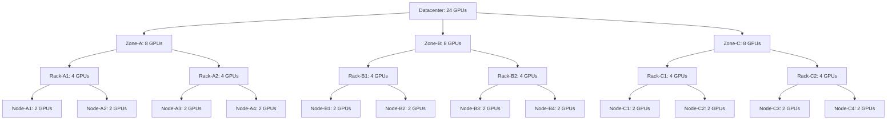

# Topology Aware Scheduling

## Summary

This design document outlines an approach for implementing topology aware scheduling in KAI-Scheduler, leveraging the topology CRD concepts from Kueue. Topology awareness enables more efficient scheduling of workloads by considering the physical placement of resources within a cluster, leading to improved performance for applications that benefit from resource locality.

## Motivation

Workloads with specific topology requirements, such as distributed training jobs or applications sensitive to inter-node communication latency, benefit significantly from intelligent placement decisions that respect the underlying hardware topology. Without topology awareness, jobs may be scheduled across physically distant nodes, leading to:

- Increased network latency and reduced bandwidth
- Suboptimal performance for compute-intensive workloads
- Inefficient resource utilization across the cluster

## Goals

- Implement topology-aware scheduling in KAI-Scheduler
- Leverage Kueue's topology CRD concepts to keep an industry standard
   - Support hierarchical topology representations (e.g., datacenter/rack/node/device)
- Provide flexible configuration options for topology-based placement
- Support both Required and Preferred topology constraint request

## Non-Goals

- Automatically detecting topology without user input
- Ensure backward compatibility with existing scheduling mechanisms
- Fixing KAI-scheduler scheduling issues with Jobs that use PodAffinity assignments

## Design Details

### Topology Representation

Following Kueue's approach, topology will be represented as a hierarchical structure that describes the physical layout of resources in the cluster.
We will be using Kueue Topology CRD as is or import its definition into KAI scheduler to simplify integrations and support it as a standard.

### Implementation Approaches

We will consider two main implementation approaches:

#### Approach 1: Topology Tree with resource sums to estimate allocation probability and effect node order by task

Similar to Kueue, this approach involves:

1. Building a tree representation of all topology hierarchies in the cluster
  * This tree will be updated with each allocation / preemption that is done in simulations
  * We will need to save and restore it in simulation checkpoints
2. Summing the resources in each topology tree node
3. Choosing the topology with the node with the most resources that fits current pod group
4. Ranking nodes according to their topology grouping
5. Prioritizing nodes that form the most cohesive topology group for a workload
6. Considering factors like:
   - Number of resources available within each topology group
   - Distance in the tree from the chosen topology group for the Job


##### Example of a topology tree structure:


* The distance from node NC4 to NC3 is 2, the distance between RB2 to NA1 is 5.
* When using hard constraints (required) this will not always find a solution even if one exists in the cluster due to fragmentation of the resources between the nodes
* It will allow for soft/preferred constraints to still ensure it schedules pods "close" to the rest of the group even if the chosen topology can't accommodate the whole job.

#### Approach 2: Simulation-based Evaluation

This approach involves:

1. Building a tree similar to Approach one
2. For each possible topology hierarchy that has enough resources:
   a. Add a virtual node selector to the job and simulate allocation

* This will work best if the first approach is implemented first
* Significant performance reduction in big clusters is expected here.


### Topology Info struct

Both approaches need to build a topology tree and update it with the changes the scheduler is doing during the session and simulation.
We will read the Topology resources during the cluster session start phase and create TopologyInfo structs that will be maintained throughout the session with every change.

#### Suggested TopologyInfo Structure

```go
// TopologyDomainID uniquely identifies a topology domain
type TopologyDomainID string

// TopologyInfo represents a topology tree for the cluster
type TopologyInfo struct {
    // Root of the topology tree
    Root *TopologyDomainInfo

    // Map of all domains by their ID for quick lookup
    Domains map[TopologyDomainID]*TopologyDomainInfo

    // Name of this topology configuration
    Name string
}

// TopologyDomainInfo represents a node in the topology tree
type TopologyDomainInfo struct {
    // Unique ID of this domain
    ID TopologyDomainID

    // Name of this domain
    Name string

    // Level in the hierarchy (e.g., "datacenter", "zone", "rack", "node")
    Level string

    // Parent domain, nil for root
    Parent *TopologyDomainInfo

    // Child domains
    Children []*TopologyDomainInfo

    // Nodes that belong to this domain
    Nodes map[string]*node_info.NodeInfo

    // Total available resources in this domain
    AvailableResources v1.ResourceList

    // Total allocated resources in this domain
    AllocatedResources v1.ResourceList

    // Depth in the tree from root (0 for root)
    Depth int
}
```

There are two possibilities as to where the struct should be built and kept:
  * Plugin - We will use a plugin that will build it in `OnSessionOpen` and will use hooks similar to DRA plugin to keep tabs on all the changes made in the cluster.
  * ClusterInfo - This can be done with TopologyInfo structs in the ClusterInfo package, the plugin will later read this from the cache to make node order decision and will update this struct with simulated allocations.
Because this might be resource intensive we will leave users with the option to totally disable it and only reference it in the plugin.


### Topology constraint request on a job

The pod-grouper will look for topology annotations on the top owner of pods and set it to fields on the PodGroup that it creates.

#### Annotations for Topology Constraints

To support topology-aware scheduling, we'll define the following annotations that can be added to job resources (e.g., Job, BatchJob, MPIJob):

1. `scheduling.kai.nvidia.com/topology-constraint-type`: Specifies whether the topology constraint is "Required" or "Preferred"
2. `scheduling.kai.nvidia.com/topology-level`: The minimal level of hierarchy that the job will care for
3. `scheduling.kai.nvidia.com/topology`: Name of the topology CRD that this job will use (support multiple different topologies on the same cluster)

Example usage on a job:
```yaml
apiVersion: batch/v1
kind: Job
metadata:
  name: topology-aware-job
  annotations:
    scheduling.kai.nvidia.com/topology-constraint-type: "Required"
    scheduling.kai.nvidia.com/topology-level: "rack"
    scheduling.kai.nvidia.com/topology: "network"
```

#### PodGroup Structure Modifications

To support topology awareness, the PodGroup CRD will be extended with the following fields:

```go
// TopologyConstraintType represents the type of topology constraint
type TopologyConstraintType string

const (
    // TopologyConstraintRequired indicates the topology constraint must be satisfied for scheduling
    TopologyConstraintRequired TopologyConstraintType = "Required"

    // TopologyConstraintPreferred indicates the topology constraint should be satisfied when possible
    TopologyConstraintPreferred TopologyConstraintType = "Preferred"
)

// TopologyConstraint defines a constraint for topology-aware scheduling
type TopologyConstraint struct {
    // Type defines whether this constraint is required or preferred.
    // Required constraints must be satisfied for scheduling to succeed.
    // Preferred constraints influence scoring but don't prevent scheduling.
    Type TopologyConstraintType `json:"type,omitempty"`

    // TopologyLevel defines the minimal level in the topology hierarchy
    // that this constraint applies to (e.g., "rack", "zone", "datacenter").
    // Jobs will be scheduled to maintain locality at this level when possible.
    TopologyLevel string `json:"topologyLevel"`

    // Topology specifies the name of the topology CRD that defines the 
    // physical layout to use for this constraint. This allows for supporting
    // multiple different topology configurations in the same cluster.
    Topology string `json:"topology,omitempty"`
}

type PodGroupSpec struct {
    // ...existing fields...
    
    // TopologyConstraint defines the topology constraints for this PodGroup
    TopologyConstraint TopologyConstraint `json:"topologyConstraints,omitempty"`
}
```

#### Pod Grouper Implementation

The pod-grouper component will be enhanced to:

1. Look for topology-related annotations on the top owner of pods
2. Extract and validate topology constraint information
3. Set the corresponding fields in the PodGroup that it creates
4. Support both Required and Preferred constraints

For pods that are part of the same job but have different topology requirements, the pod-grouper will use the most restrictive constraints to ensure all pods can be scheduled.

### Integration with KAI-Scheduler

The topology-aware scheduling will integrate with KAI-Scheduler's existing components:

1. **Plugin Architecture**: Implement as a plugin that can be enabled/disabled
2. **Scoring Mechanism**: Add topology-based scoring to node ranking
3. **API Extensions**: Provide APIs for specifying topology preferences in workloads

### User Experience

Users will be able to:

1. Define topology constraints in their workload specifications
2. Set preferences for topology-aware placement
3. Configure the relative importance of topology vs. other scheduling factors
4. View topology information for their running workloads

## Implementation Plan

The implementation will proceed in phases:

1. Basic topology representation and ResourceGroup CRD integration
2. Implementing TopologyInfo
2. Implementation of Approach 1 (Topology Tree with Ranking)
3. Performance evaluation and optimization
4. User experience improvements and documentation
5. Implementation of Approach 2 (Simulation-based Evaluation)
6. Performance evaluation and optimization
7. User experience improvements and documentation

## Alternatives Considered

- Using existing Kubernetes topology mechanisms like topology spread constraints, pod affinity

These alternatives were considered but rejected due to breaking away from what end users already know and expect them to do and the need to create something more limiting to allow the algorithms to be more simple.

## Future Work

- Dynamic topology discovery and adaptation
- Machine learning-based topology optimization
- Support for workload-specific topology requirements (PodAffinity will define the topology and the requirements? )
- Integration with cloud provider topology APIs
- Integration with Topograph

## References

- KAI-Scheduler issue #66: Topology Aware Scheduling
- [Kueue Topology CRD documentation](https://kueue.sigs.k8s.io/docs/concepts/topology_aware_scheduling/)
