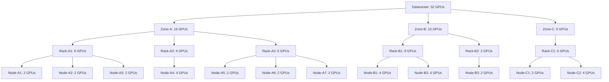

# Topology Aware Scheduling

## Summary

This design document outlines an approach for implementing topology aware scheduling in KAI-Scheduler, leveraging the topology CRD concepts from Kueue. Topology awareness enables more efficient scheduling of workloads by considering the physical placement of resources within a cluster, leading to improved performance for applications that benefit from resource locality.

## Motivation

Workloads with specific topology requirements, such as distributed training jobs or applications sensitive to inter-node communication latency, benefit significantly from intelligent placement decisions that respect the underlying hardware topology. Without topology awareness, jobs may be scheduled across physically distant nodes, leading to:

- Increased network latency and reduced bandwidth
- Suboptimal performance for compute-intensive workloads
- Inefficient resource utilization across the cluster

## Usage Stories

### Better Inter Pod Communication

Distributed workload with high volume of communication between pods will prefer the pods to be as close as possible, with the highest volume and speed of network between them.
If not possible to allocate them on the same node, then on the same rack or block. It is more important that it starts running than that it fills the exact topology requirements.

### Highly Optimized With Regard to Network Infrastructure

This workload wants to make sure that it takes advantage of the best setup its network can give.
It wants to split the pods into groups that will fill entire nodes, and the groups be on the same rack if possible, or close one from the same block.
The pods then need to get some hints to their respective location in this internal job topology.

## Goals

- Implement topology-aware scheduling in KAI-Scheduler
- Leverage Kueue's topology CRD concepts to keep an industry standard
   - Support hierarchical topology representations (e.g., datacenter/rack/node/device)
- Provide flexible configuration options for topology-based placement
- Support both Required and Preferred topology constraint request
- Checking more possible allocations than is possible for PodAffinity pod groups: When the scheduler tries to schedule a pod group with multiple pods that have a pod affinity requirement it finds a suitable node for the  first pods and that node's label is then used to compare the pod affinity of the next pods in the pod group. If the rest of the pods can't be allocated with that node affinity then the first pod's allocation is not attempted on another node. We aim to fix this issue

## Non-Goals

- Automatically detecting topology without user input
- Improve allocations found for jobs using PodAffinity.

## Design Details

### User Experience

Users will be able to:

1. Define topology constraints in their workload specifications
2. Define the way a job can be split into several topologies
3. Set preferences for topology-aware placement - strict (Only schedule the job if it can get the topology requirements) or preferred (Do your best, but I prefer to start running than to wait for the perfect setup)
4. View topology information for their running workloads

### Topology Representation

Following Kueue's approach, topology will be represented as a hierarchical structure that describes the physical layout of resources in the cluster.
We will be using Kueue Topology CRD as is or import its definition into KAI scheduler to simplify integrations and support it as a standard.

### Topology constraint request on a job

The pod-grouper will look for topology annotations on the top owner of pods and set it to fields on the PodGroup that it creates.

#### Annotations for Topology Constraints

To support topology-aware scheduling, we'll define the following annotations that can be added to job resources (e.g., Job, BatchJob, MPIJob):

1. `kai.scheduler/topology-preferred-placement`: The preferred topology level at which all the pods of the job will be scheduled.
2. `kai.scheduler/topology-required-placement`: The maximal level of hierarchy that the job will be scheduled into. 
3. `kai.scheduler/topology`: Name of the topology CRD that this job will use (support multiple different topologies on the same cluster)

Example usage on a job:
```yaml
apiVersion: batch/v1
kind: Job
metadata:
  name: topology-aware-job
  annotations:
    kai.scheduler/topology-preferred-placement: "rack"
    kai.scheduler/topology-required-placement: "zone"
    kai.scheduler/topology: "network"
```

It is possible to only use one of preferred or required, but the topology CRD must be named.

#### PodGroup Structure Modifications

To support topology awareness, the PodGroup CRD will be extended with the following fields:

```go
// TopologyConstraint defines a constraint for topology-aware scheduling
type TopologyConstraint struct {
    // PreferredTopologyLevel defines the preferred level in the topology hierarchy
    // that this constraint applies to (e.g., "rack", "zone", "datacenter").
    // Jobs will be scheduled to maintain locality at this level when possible.
    PreferredTopologyLevel string `json:"preferredTopologyLevel,omitempty"`

    // RequiredTopologyLevel defines the maximal level in the topology hierarchy
    // that all pods must be scheduled within.
    // If set, all pods of the job must be scheduled within a single domain at this level.
    RequiredTopologyLevel string `json:"requiredTopologyLevel,omitempty"`

    // Topology specifies the name of the topology CRD that defines the 
    // physical layout to use for this constraint. This allows for supporting
    // multiple different topology configurations in the same cluster.
    Topology string `json:"topology,omitempty"`
}

type PodGroupSpec struct {
    // ...existing fields...
    
    // TopologyConstraint defines the topology constraints for this PodGroup
    TopologyConstraint TopologyConstraint `json:"topologyConstraints,omitempty"`
}
```

### Assumptions / Requirements From Pod Groups

- All pods must have the same requirements and roles
    - orchestrator / leader pods should also act as workers and be scheduled with the rest.
    - This is planned to be solved as an issue when a hierarchy of pod groups is supported.
- No order or rank is predefined on the pods.

### Implementation Stages

We will consider two main implementation approaches:

#### Stage 1: Plugin for node order / filter
The plugin will maintain an internal topology tree with resource sums to estimate allocation probability and effect node order by task.

This stage involves:

1. Building a tree representation of all topology hierarchies in the cluster
  * This tree will be updated with each allocation / preemption that is done in simulations
  * We will need to save and restore it in simulation checkpoints
2. Summing the resources in each topology tree node
3. For each job creating a topology tree that also has the number of allocatable pods in each tree node
4. Choosing the topology with the tree node that best fits the pod group
5. Ranking cluster nodes according to their topology grouping
6. Prioritizing cluster nodes that form the most cohesive topology group for a workload
7. Considering factors like:
   - Number of resources available within each topology group
   - Distance in the tree from the chosen topology group for the Job


##### Example of a topology tree structure:


* The distance from node NC1 to NC2 is 2, the distance between RB1 to NA1 is 5.
* When using hard constraints (required) this will not always find a solution even if one exists in the cluster due to fragmentation of the resources between the nodes or other scheduling constraints.
* If no tree node is found and the topology constraint is set to preferred we will choose the tree node that can accommodate the most pods and rank the rest by distance.
* It will allow for soft/preferred constraints to still ensure it schedules pods "close" to the rest of the group even if the chosen topology can't accommodate the whole job.
* For each job it will calculate bottom up the number of pods that can be allocated in each tree node, to improve precision.

#### Stage 2: Simulation-based Evaluation

This stage extends the use of topology information in the allocation of jobs in all actions by iterating on the possible topologies and checking them against all available filters to verify that the allocation will succeed.

1. Add a new plugin point to get a list of possible nodes from the plugin (similar to the "FeasibleNodesForJob" function, that could also be moved to a plugin).

    ```go
    FeasibleNodes(PodGroupInfo) [][]*NodeInfo
    ```

    The order of the topology groups in the returned list should be determined by the spread/bin packing parameter.

2. Iterate over all the groups of feasible nodes returned by the plugin, each group for a different suggested topology that should fit the job and attempt to allocate the job there.

* Significant performance reduction in big clusters is expected here because this might lead to attempting many topologies that can't really get to run the job due to missing DRA/Volume or some other condition. On the other hand the first stage alone would not find the right allocation for those jobs.


#### Topology Info struct

Both approaches need to build a topology tree and update it with the changes the scheduler is doing during the session and simulation.
We will read the Topology resources during the cluster session start phase and create TopologyInfo structs that will be maintained throughout the session with every change.

```go
// TopologyDomainID uniquely identifies a topology domain
type TopologyDomainID string

// TopologyInfo represents a topology tree for the cluster
type TopologyInfo struct {
    // Root of the topology tree
    Root *TopologyDomainInfo

    // Map of all domains by their ID for quick lookup
    Domains map[TopologyDomainID]*TopologyDomainInfo

    // Name of this topology configuration
    Name string
}

// TopologyDomainInfo represents a node in the topology tree
type TopologyDomainInfo struct {
    // Unique ID of this domain
    ID TopologyDomainID

    // Name of this domain
    Name string

    // Level in the hierarchy (e.g., "datacenter", "zone", "rack", "node")
    Level string

    // Parent domain, nil for root
    Parent *TopologyDomainInfo

    // Child domains
    Children []*TopologyDomainInfo

    // Nodes that belong to this domain
    Nodes map[string]*node_info.NodeInfo

    // Total available resources in this domain
    AvailableResources v1.ResourceList

    // Total allocated resources in this domain
    AllocatedResources v1.ResourceList

    // Number of pods that can be allocated in this domain
    AllocatablePods int

    // List of resources requested by each pod in the job this tree is built for
    RequestedResources v1.ResourceList

    // Depth in the tree from root (0 for root)
    Depth int
}
```

This struct will be built and updated in a dedicated topology plugin.

#### Topology Awareness Plugin

##### Setup
Maintain all topology trees with available resources using the Allocate/Deallocate event handlers (similar to the dynamicresources plugin)

##### Pre Process
* Register the PrePredicate function to create a job-specific tree with the amount of allocatable pods filled for each tree node according to the resources requested by each pod in the job.
  * Consider changing the name to PreFilter or PreProcess
* Using this data we can then choose the best topology (represented by the tree nodes) for the job.
* When multiple topologies are available, we can choose the one most fitting to the bin packing or spreading (For example if bin packing was requested than get the topology with the least resources)
* The per-job preprocessed tree will be built from the base tree that is maintained by the plugin.
* We will use here the assumption that all the pods have the same resource requirements to calculate for each tree node the amount of pods that can be allocated in it (using post order traverse).

####  Node Ordering and Filtering
- This is currently called per task, so with the current setup it will have to cache the result in the plugin (Possibly also using the resources tree hash?)
- Search for the best allocation of the job in the tree and save that too for the next Predicate and NodeOrder calls.
    - Predicate function will only be used for strict topology-aware scheduling.
- NodeOrder will rank the selected node above all and then other nodes by distance. Use a factor that will make this plugin more dominant the any other (similar to pod affinity node order).
- For future extensions: New plugin point for `BeforeBind` will allow to mutate the bind request / pod creating the bind request. It will be used to add rank labels to the pod in order to specify its chosen rank inside the job.

### Pod Grouper Implementation

The pod-grouper component will be enhanced to:

1. Look for topology-related annotations on the top owner of pods
2. Extract and validate topology constraint information
3. Set the corresponding fields in the PodGroup that it creates
4. Support both Required and Preferred constraints

## Possible Extensions
We can extend the suggested implementation to support job segmentation into blocks (similarly to SLURM's topology/block plugin) or to support hierarchy of pod groups (with new concepts like SuperPodGroup) by searching to allocate a whole subtree inside the internal topology tree.

## Implementation Plan

The implementation will proceed in phases:

1. Basic topology representation and Kueue Topology CRD integration
2. Pod Grouper and Pod Group changes
2. Implementing TopologyInfo and updating its resources with current pod allocation and simulations.
3. Implementation of Approach 1 in a topology plugin (can be the same plugin from step 2.)


## Alternatives Considered

- Using existing Kubernetes topology mechanisms like topology spread constraints, pod affinity

These alternatives were considered but rejected due to breaking away from what end users already know and expect them to do and the need to create something more limiting to allow the algorithms to be more simple.

## References

- KAI-Scheduler issue #66: Topology Aware Scheduling
- [Kueue Topology CRD documentation](https://kueue.sigs.k8s.io/docs/concepts/topology_aware_scheduling/)
