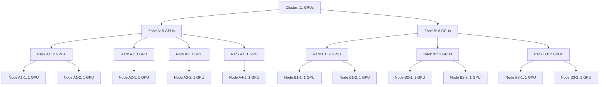

# Topology Aware Scheduling
KAI Scheduler incorporates topology awareness and schedules workloads with consideration for the physical placement of nodes.

## Topological Information
Topology information is derived from both Kubernetes node labels and the Kueue Topology CRD:
```yaml
apiVersion: kueue.x-k8s.io/v1alpha1
kind: Topology
metadata:
  name: "cluster-topology"
spec:
  levels:
  - nodeLabel: "cloud.provider.com/topology-block"
  - nodeLabel: "cloud.provider.com/topology-rack"
  - nodeLabel: "kubernetes.io/hostname"
```
A topology definition must include at least one level with a label selector. Based on this configuration, KAI Scheduler organizes nodes into hierarchical domains aligned with the specified labels. 

## Topology Constraints
Workloads that require location-aware scheduling can declare topology constraints via annotations, using either required or preferred placement.

To enforce strict rack-level locality, a workload can be annotated as follows:
```yaml
kai.scheduler/topology: "cluster-topology"
kai.scheduler/topology-required-placement: "cloud.provider.com/topology-rack"
```
With a required placement, the scheduler will not place the workload on nodes lacking the specified label.

For soft affinity, the annotation can specify a preferred placement:
```yaml
kai.scheduler/topology: "cluster-topology"
kai.scheduler/topology-preferred-placement: "cloud.provider.com/topology-rack"
```
In this case, the scheduler will first target nodes matching the label. If no suitable nodes are available, it will fall back to a higher-level topology domain. 

You can also combine required and preferred placement in a single workload. In this model, the required constraint sets the upper boundary for eligible domains, while the preferred constraint guides the scheduler toward a more granular placement within that boundary. 
For example, a workload can require block-level placement while preferring rack-level locality, allowing tighter affinity without expanding the scheduling scope to the entire cluster.
Such constraint can be expressed as:
```yaml
kai.scheduler/topology: "cluster-topology"
kai.scheduler/topology-required-placement: "cloud.provider.com/topology-block"
kai.scheduler/topology-preferred-placement: "cloud.provider.com/topology-rack"
```

## Scheduling Strategy

The topology-aware scheduler uses a two-level approach to optimize both resource utilization and pod locality. Both levels evaluate available resources relative to the workload request, but prioritize in opposite directions:

### Domain Selection (Bin-Packing)
When selecting which topology domain to schedule a workload into, the scheduler prioritizes domains with **less available resources** relative to the workload request (higher requested-to-available ratio). This bin-packing strategy helps consolidate workloads into domains that are already relatively full, leaving other domains available for future allocations and improving overall cluster utilization.

### Node Ordering Within Domains
Once a domain is selected, if the workload specifies a **preferred topology level** (e.g., `topology-preferred-placement: "rack"`), the scheduler orders nodes to maximize pod proximity at that level. Nodes belonging to sub-domains at the preferred level with **more available resources** relative to the workload request are prioritized. This ensures that more pods from the same workload are allocated within the same preferred sub-domain (e.g., the same rack), minimizing inter-pod communication latency.

## Example

Consider a cluster with the following topology:
- **Zone A**: 4 racks - Rack 1 has 2 nodes with 1 GPU per node, Racks 2-4 each have 1 node with 1 GPU (total: 5 GPUs)
- **Zone B**: 3 racks, each rack has 2 nodes with 1 GPU per node (total: 6 GPUs)



A workload is submitted with the following requirements:
- 3 tasks, each requiring 1 GPU
- Topology constraint: requires zone-level placement, prefers rack-level locality
```yaml
apiVersion: batch/v1
kind: Job
metadata:
  name: distributed-training
  annotations:
    kai.scheduler/topology: "cluster-topology"
    kai.scheduler/topology-required-placement: "topology.kubernetes.io/zone"
    kai.scheduler/topology-preferred-placement: "topology.kubernetes.io/rack"
spec:
  parallelism: 3
  completions: 3
  # ... job specification requiring 1 GPU per pod
```

### Scheduling Decision

**Step 1: Domain Selection (Bin-Packing)**

The scheduler filters out irrelevant domains that cannot accommodate the entire workload. In this case, all rack-level domains are filtered out because none has 3 or more GPUs available (Rack 1 has only 2 GPUs, the maximum). The scheduler then evaluates domains at the zone level as specified by the required placement constraint.

The scheduler evaluates both zones:
- Zone A: 5 available GPUs
- Zone B: 6 available GPUs

**Zone A is selected** because it has fewer available resources, promoting bin-packing.

**Step 2: Node Ordering Within Zone A (Pod Locality)**

Within Zone A, the scheduler prioritizes racks with more available resources to maximize pod concentration. Rack A1 has 2 GPUs available (the most), so the scheduler fills Rack A1 completely (2 pods) before moving to Rack A2 (1 pod).

**Result**: The 3 pods are placed on **2 racks** instead of spreading across 3 racks, maximizing pod proximity at the preferred rack level.

## Multi-level Topology Aware Scheduling
KAI Scheduler supports multi-level topologies, where each level can be defined with a different constraint.
More information about it can be found in the [Multi-Level Topology Aware Scheduling](multilevel.md) section.

